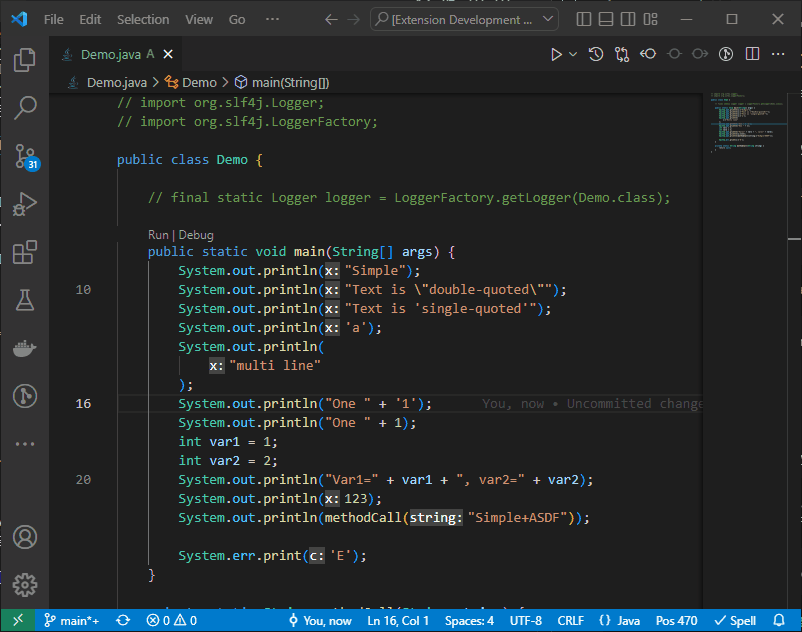

# Legacy Java Code Refactoring extension for VS Code

<!-- [](https://marketplace.visualstudio.com/items?itemName=jan-dolejsi.java-refactoring)
[](https://marketplace.visualstudio.com/items?itemName=jan-dolejsi.java-refactoring)
[](https://marketplace.visualstudio.com/items?itemName=jan-dolejsi.java-refactoring&ssr=false#review-details)
[](https://marketplace.visualstudio.com/items?itemName=jan-dolejsi.java-refactoring) -->
[](https://github.com/jan-dolejsi/vscode-java-refactoring/actions/workflows/main.yml)

## `System.out|err` -> `logger.info|debug|trace|error`

If you place your cursor on a line containing a `System.out` or `System.err` calls, a code action will be proposed to convert them to a logger call while refactoring the argument.

For example, with a single click, you can convert this line:

```java
System.out.println("Var1=" + var1 + ", var2=" + var2);
```

...to...

```java
logger.info("Var1={}, var2={}", var1, var2);
```

... which allows flexibly setting the verbosity level using post-deployment configuration, while diagnosing runtime issues.

Doing this manually is a tedious and error prone process.



### Pre-requisites

You will need to add imports to your Java class:

```java
import org.slf4j.Logger;
import org.slf4j.LoggerFactory;
```

You will need the static declaration of the `logger` field inside the class:

```java
private static final Logger logger = LoggerFactory.getLogger(YourClass.class);
```

You will also need to add the dependency on the package. See <https://www.slf4j.org/manual.html> for more info.

Alternatively, you may just decorate your class with [`@Slf4j`](https://projectlombok.org/api/lombok/extern/slf4j/Slf4j) attribute, if you also use [lombok](https://projectlombok.org/).

### Known issues

The extension does not handle `System.out` calls with multiple arguments that already use `%s` and other macros.

Line and block comments inside the `System.out` method call may also not be handled correctly.

## Development

Code actions are used to implement quick fixes and [refactoring](https://code.visualstudio.com/docs/editor/refactoring) in VS Code. We use [`CodeActionProvider`](https://code.visualstudio.com/api/references/vscode-api#CodeActionProvider) api to implement a small set of refactoring that occur chronically in code written by our dear colleague DL.
